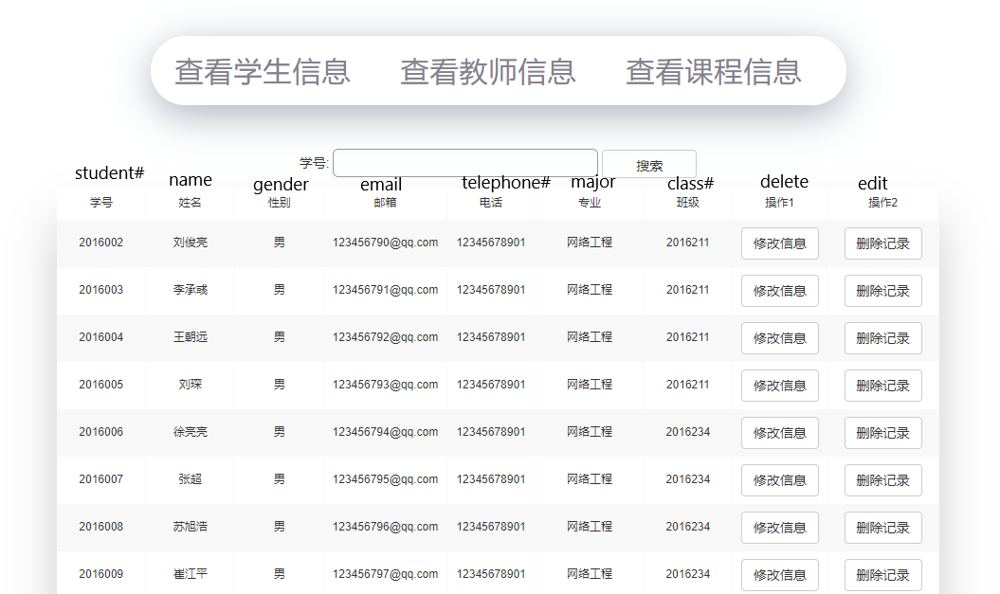
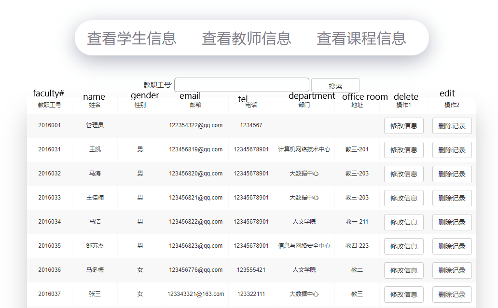
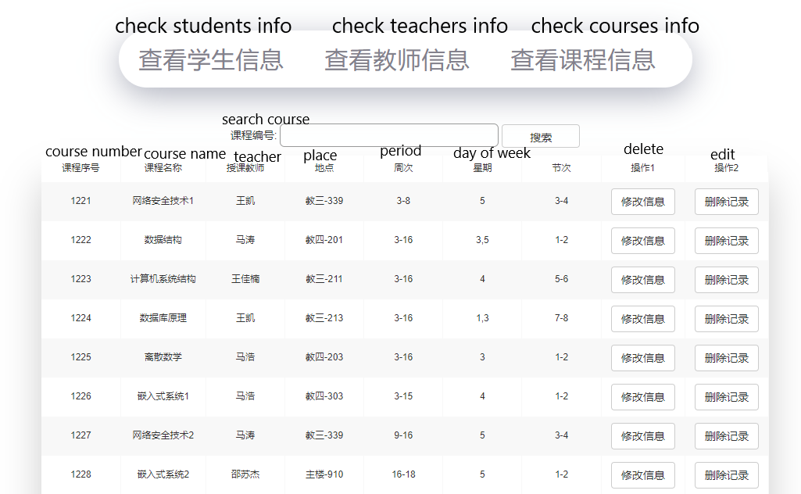
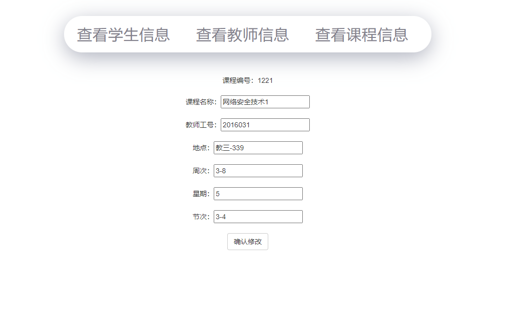

# GradeManagementSystem - 
A Grade Management System built on the framework of SSM(SpringIoc, SpringMVC, Mybatis)


## Table of Contents
* [Introduction](#introduction)
* [Technologies](#technologies)
* [Functionalities](#functionalities)
* [Structure](#structure)
* [Launch](#launch)
* [Examples](#examples)

## Introduction 
* This system is a web application which is aimed to make it more convenient to the manage students' grades.

## Technologies
* For the front-end, we choose JSP.

* For back-end, we choose SSM framework, more exactly, SpringIoc, SpringMVC, and Mybatis; as for charts and diagrams, we choose a tool called JFreeChart.

* We use Mysql as our database.

## Functionalities
### Our application are generally used by 3 roles:
* Students: They are allowed to check their personal information, course table, and their grades.

* Teachers: They are allowed to check their personal information, course table, and their teaching grades; and they are also allowed to upload, delete, change, and check students' grades; and they can see the statistic information about grades.

* Administrator: They are given the authorization to manage students' and teachers' personal information, and course information.

## Structure
```
+---src
|   |   applicationContext.xml
|   |   jdbc.properties
|   |   log4j.properties
|   |   mybatis.cofig.xml
|   |   springmvc.xml
|   +---dao
|   +---mapper   
|   +---po   
|   +---service
|   |   \---impl       
|   +---utils     
|   \---web
\---WebContent  
    +---pages
    |   \---js
    \---WEB-INF
        |   web.xml
        \---lib

```
* The folder dao contains interfaces to manipulate database.

* The folder mapper contains mybatis xml files that implementing database manipulation.

* The foleder po consists of entities in application.

* The folder service contains service interfaces and their implementation.

* The folder utils contains utility classes needed by application.

* The folder web comprises the interfaces between front-end and back-end.

* The folder pages contains views and javascript functions.

* The remaining files are configuration files.

## Launch
### 1. Prepare Database
 You need to run the db.sql in the repository to generate the database table structures. Change the database username and password to your owns in src/jdbc.properties

### 2. Configure Tomcat
Install and configure tomcat web server, choose 9.0 version. Configure the server port to 8081.

### 3. Run tomcat server at localhost
Type in http://localhost:8081/ssm/pages/index.jsp at browser, and you will be at the login page.

## Examples
### Here are some examples when running the system as an administrator:
### 1. Students information Page


### 2. Teachers information Page


### 3. Course information Page


### 4. Edit Course information Page


### More pages will be found when you run our application